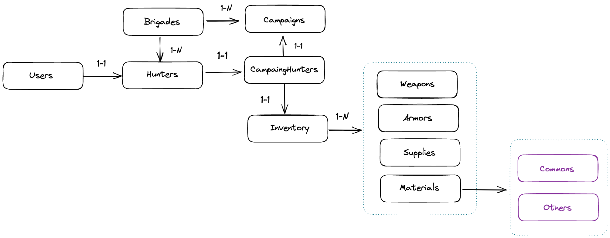

## Run application locally
First of all we must run docker to start the postgres DB and postgress admin
```bash
docker compose up
```

when DB is running we can acces into http://localhost:5050/ to access into PG Admin sometimes we will need to set the host name for the server, then run **ifconfig** command and get the local IP, set the username and password of the DB.

## Entity relation

